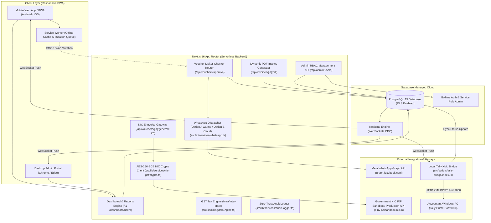

# SYSTEM DESIGN DOCUMENT (SD)
## Project: Livekeeping Open — Enterprise Architecture & System Specifications
**Version:** 2.0.0  
**Stack:** Next.js 16 (Turbopack, App Router) • TypeScript • Tailwind CSS • Supabase (PostgreSQL & Realtime) • Node.js XML Bridge • Government NIC IRP E-Invoice Gateway

---

## 1. System Architecture Diagram



---

## 2. Database Schema (PostgreSQL DDL)

### 2.1. Enums & Custom Types
```sql
CREATE TYPE user_role AS ENUM ('admin', 'manager', 'checker', 'maker');
CREATE TYPE voucher_type AS ENUM ('sales_bill', 'quotation', 'receipt', 'purchase_order', 'delivery_challan');
CREATE TYPE payment_status AS ENUM ('pending', 'approved', 'rejected', 'paid', 'cancelled');
```

### 2.2. Core Tables
```sql
-- 1. User Profiles & RBAC
CREATE TABLE public.profiles (
    id UUID PRIMARY KEY REFERENCES auth.users(id) ON DELETE CASCADE,
    email TEXT NOT NULL UNIQUE,
    full_name TEXT NOT NULL,
    role user_role NOT NULL DEFAULT 'maker',
    organization_id TEXT NOT NULL DEFAULT 'org-101',
    created_at TIMESTAMPTZ NOT NULL DEFAULT NOW(),
    updated_at TIMESTAMPTZ NOT NULL DEFAULT NOW()
);

-- 2. Vouchers / Invoices Table
CREATE TABLE public.vouchers (
    id TEXT PRIMARY KEY,
    organization_id TEXT NOT NULL DEFAULT 'org-101',
    voucher_number TEXT NOT NULL UNIQUE,
    voucher_type voucher_type NOT NULL DEFAULT 'sales_bill',
    party_name TEXT NOT NULL,
    party_gstin TEXT,
    billing_address TEXT,
    place_of_supply TEXT DEFAULT '24-Gujarat',
    total_amount NUMERIC(12, 2) NOT NULL,
    tax_amount NUMERIC(12, 2) DEFAULT 0.00,
    status payment_status NOT NULL DEFAULT 'pending',
    irn_number TEXT,
    eway_bill_no TEXT,
    signed_qr_code TEXT,
    items JSONB DEFAULT '[]'::jsonb,
    tally_synced BOOLEAN DEFAULT FALSE,
    tally_sync_time TIMESTAMPTZ,
    created_by UUID REFERENCES auth.users(id),
    approved_by UUID REFERENCES auth.users(id),
    created_at TIMESTAMPTZ NOT NULL DEFAULT NOW(),
    updated_at TIMESTAMPTZ NOT NULL DEFAULT NOW()
);

-- 3. Field Sales Geolocation Logs
CREATE TABLE public.sales_field_logs (
    id UUID PRIMARY KEY DEFAULT gen_random_uuid(),
    user_id UUID REFERENCES auth.users(id),
    latitude DOUBLE PRECISION NOT NULL,
    longitude DOUBLE PRECISION NOT NULL,
    accuracy DOUBLE PRECISION,
    note TEXT,
    captured_at TIMESTAMPTZ NOT NULL DEFAULT NOW()
);
-- 4. Immutable System Audit Logs (Zero-Trust DLP)
CREATE TABLE public.system_audit_logs (
    id UUID PRIMARY KEY DEFAULT gen_random_uuid(),
    user_id UUID REFERENCES auth.users(id),
    action TEXT NOT NULL,
    entity_name TEXT NOT NULL,
    entity_id TEXT,
    ip_address TEXT,
    old_data JSONB,
    new_data JSONB,
    created_at TIMESTAMPTZ DEFAULT NOW()
);
```

### 2.3. Row Level Security (RLS) & Automated Audit Triggers
```sql
ALTER TABLE public.profiles ENABLE ROW LEVEL SECURITY;
ALTER TABLE public.vouchers ENABLE ROW LEVEL SECURITY;
ALTER TABLE public.sales_field_logs ENABLE ROW LEVEL SECURITY;
ALTER TABLE public.system_audit_logs ENABLE ROW LEVEL SECURITY;

-- Allow authenticated users to read vouchers of their organization
CREATE POLICY "Users can read vouchers in their org" ON public.vouchers
    FOR SELECT USING (auth.role() = 'authenticated');

-- Makers and Checkers can insert new vouchers
CREATE POLICY "Makers and Checkers can insert vouchers" ON public.vouchers
    FOR INSERT WITH CHECK (auth.role() = 'authenticated');

-- Checkers and Admins can update status
CREATE POLICY "Checkers and Admins can update vouchers" ON public.vouchers
    FOR UPDATE USING (
        EXISTS (
            SELECT 1 FROM public.profiles
            WHERE profiles.id = auth.uid()
            AND profiles.role IN ('admin', 'checker', 'manager')
        )
    );

-- Audit Logs: Read-only for Admins, no INSERT/UPDATE/DELETE allowed for regular users
CREATE POLICY "Admins view audit logs" ON public.system_audit_logs 
    FOR SELECT USING (
        EXISTS (SELECT 1 FROM public.profiles WHERE id = auth.uid() AND role = 'admin')
    );

-- Automated Voucher Audit Trigger
CREATE OR REPLACE FUNCTION log_voucher_changes()
RETURNS TRIGGER AS $$
BEGIN
    INSERT INTO public.system_audit_logs (user_id, action, entity_name, entity_id, old_data, new_data)
    VALUES (
        auth.uid(),
        TG_OP,
        'vouchers',
        COALESCE(NEW.id, OLD.id),
        CASE WHEN TG_OP IN ('UPDATE', 'DELETE') THEN to_jsonb(OLD) ELSE NULL END,
        CASE WHEN TG_OP IN ('INSERT', 'UPDATE') THEN to_jsonb(NEW) ELSE NULL END
    );
    RETURN NEW;
END;
$$ LANGUAGE plpgsql SECURITY DEFINER;

CREATE TRIGGER audit_vouchers_trigger
AFTER INSERT OR UPDATE OR DELETE ON public.vouchers
FOR EACH ROW EXECUTE FUNCTION log_voucher_changes();
```

### 2.4. Automated Tax Calculation Engine (`src/lib/billing/taxEngine.ts`)
- **Intra-State Supply (Seller State == Buyer State)**:
  `CGST = totalTax / 2`, `SGST = totalTax / 2`, `IGST = 0`
- **Inter-State Supply (Seller State != Buyer State)**:
  `CGST = 0`, `SGST = 0`, `IGST = totalTax`
- **Precision**: 2-decimal rounded precision arithmetic across all line items and invoice grand totals.

---

## 3. Serverless API Endpoint Specifications

### 3.1. Maker-Checker Voucher Approval
- **Endpoint:** `POST /api/vouchers/approve`
- **Headers:** `Content-Type: application/json`
- **Request Payload:**
  ```json
  {
    "voucherId": "mock-1",
    "approvedBy": "user-uuid-or-checker-01",
    "voucherNumber": "INV/2026-27/001",
    "partyName": "ABC Infotech Private Limited",
    "amount": 185250
  }
  ```
- **Response (HTTP 200 OK):**
  ```json
  {
    "success": true,
    "message": "Voucher approved successfully, WhatsApp dispatch ready, and queued for Tally sync.",
    "voucherId": "mock-1",
    "whatsappSent": true,
    "directUrl": "https://wa.me/919876543210?text=..."
  }
  ```

### 3.2. 1-Click Government NIC E-Invoice (IRN) Generation
- **Endpoint:** `POST /api/vouchers/[id]/generate-irn`
- **Response (HTTP 200 OK):**
  ```json
  {
    "success": true,
    "irn": "a7b8c9d0e1f2a3b4c5d6e7f8a9b0c1d2e3f4a5b6c7d8e9f0a1b2c3d4e5f6a7b8",
    "ewayBillNo": "241089274912",
    "ackNo": "112026090812345",
    "ackDt": "2026-10-08 18:15:00",
    "signedQrCode": "data:image/svg+xml;base64,..."
  }
  ```

### 3.3. Dynamic PDF Invoice Rendering
- **Endpoint:** `GET /api/invoices/[id]/pdf`
- **Response:** `Content-Type: text/html; charset=utf-8` (with automated browser print execution trigger and embedded GST breakdown table).

### 3.4. Admin User Management (RBAC)
- **`GET /api/admin/users`**: Lists all profiles and auth user records.
- **`POST /api/admin/users`**: Creates new user via `supabaseAdmin.auth.admin.createUser` and creates record in `public.profiles`.
- **`PATCH /api/admin/users`**: Updates user role or resets password.
- **`DELETE /api/admin/users`**: Deletes auth account and cascades profile removal.

---

## 4. Local Windows Tally XML Bridge Architecture
- **Location:** `src/scripts/tally-bridge/`
- **Execution Script:** `node src/scripts/tally-bridge/index.js` or `start-tally-sync.bat`
- **Tally XML Protocol Template:**
```xml
<ENVELOPE>
  <HEADER>
    <TALLYREQUEST>Import Data</TALLYREQUEST>
  </HEADER>
  <BODY>
    <IMPORTDATA>
      <REQUESTDESC>
        <REPORTNAME>Vouchers</REPORTNAME>
        <STATICVARIABLES>
          <SVCURRENTCOMPANY>Livekeeping Enterprises</SVCURRENTCOMPANY>
        </STATICVARIABLES>
      </REQUESTDESC>
      <REQUESTDATA>
        <TALLYMESSAGE xmlns:UDF="TallyUDF">
          <VOUCHER VCHTYPE="Sales" ACTION="Create">
            <DATE>20261008</DATE>
            <VOUCHERNUMBER>INV/2026-27/001</VOUCHERNUMBER>
            <PARTYLEDGERNAME>ABC Infotech Private Limited</PARTYLEDGERNAME>
            <ALLLEDGERENTRIES.LIST>
              <LEDGERNAME>ABC Infotech Private Limited</LEDGERNAME>
              <ISDEEMEDPOSITIVE>Yes</ISDEEMEDPOSITIVE>
              <AMOUNT>-185250.00</AMOUNT>
            </ALLLEDGERENTRIES.LIST>
            <ALLLEDGERENTRIES.LIST>
              <LEDGERNAME>Sales GST Account</LEDGERNAME>
              <ISDEEMEDPOSITIVE>No</ISDEEMEDPOSITIVE>
              <AMOUNT>156991.52</AMOUNT>
            </ALLLEDGERENTRIES.LIST>
            <ALLLEDGERENTRIES.LIST>
              <LEDGERNAME>Output IGST 18%</LEDGERNAME>
              <ISDEEMEDPOSITIVE>No</ISDEEMEDPOSITIVE>
              <AMOUNT>28258.48</AMOUNT>
            </ALLLEDGERENTRIES.LIST>
          </VOUCHER>
        </TALLYMESSAGE>
      </REQUESTDATA>
    </IMPORTDATA>
  </BODY>
</ENVELOPE>
```

---

## 5. Offline-First Resilience & Service Worker Life Cycle
1. **Network Detection:** Global event listener in `src/components/PWAProvider.tsx` (`navigator.onLine`).
2. **Offline Mutation Queue:** When offline, `handleCreateVoucher` passes the record to `queueOfflineVoucher(voucher)` in `src/lib/services/offlineSync.ts`.
3. **Storage Engine:** IndexedDB / LocalStorage key `livekeeping_offline_mutation_queue`.
4. **Auto-Reconciliation:** When `window.addEventListener('online')` fires, `syncOfflineVouchers()` iterates through pending entries, POSTs them to Supabase, and removes synced IDs from the local store.
